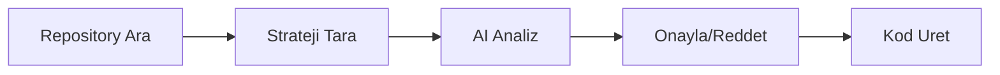

# Opus Backtrader - AI Coding Agent Context

> Last updated: 26 May 2026 | Update this file when architecture changes

## Project Overview

**Opus Backtrader** is an AI-powered quantitative trading system for strategy discovery, backtesting, and code generation.

**Architecture:** FastAPI backend + Next.js frontend.

**Core Workflows:**
- **Reddit** → AI Analysis → Strategy Extraction → Python Code → Backtest
- **GitHub** → Repo Search → Strategy Detection → AI Analysis → Approve → Code

## Tech Stack

| Layer | Technology |
|-------|------------|
| **Backend** | FastAPI (Python 3.12), uvicorn, async |
| **Frontend** | Next.js 15, React 19, TypeScript, Tailwind CSS |
| **Database** | SQLite (scraped_strategies.db + trading.db), PostgreSQL 16 ready |
| **Cache/Queue** | Redis 7 |
| **Engine** | Backtrader (Python backtesting core) |
| **Data** | tvdatafeed (TradingView), yfinance, ccxt |
| **Charts** | TradingView Lightweight Charts (frontend) |
| **Deployment** | Docker Compose (local + VDS) |

### AI Models (Multi-Provider)

| Model | Provider | Usage | Cost/1M tokens |
|-------|----------|-------|----------------|
| **GLM-4.7** | Zhipu AI | Code generation, Pine↔Python conversion | $0.11 in / $0.28 out |
| **GPT-4o-mini** | OpenAI | Strategy extraction, classification | $0.15 in / $0.60 out |
| Claude Sonnet | Anthropic | Fallback for complex tasks | $3.00 in / $15.00 out |

**Priority:** GLM-4.7 > GPT-4o-mini > Claude (auto-selected based on availability)

## Key Entry Points

| Command | Purpose |
|---------|---------|
| `docker compose up` | Full stack (PG + Redis + BE + FE) |
| `uvicorn app.main:app --reload` | Backend only (from `backend/`) |
| `npm run dev` | Frontend only (from `frontend/`) |
| `python main.py --strategy <name> --symbol <X>` | CLI backtest |

## Directory Map

```
opus-backtrader/
├── backend/                    # FastAPI Backend
│   ├── app/
│   │   ├── main.py            # FastAPI app entry, CORS, lifespan
│   │   ├── api/routes/        # REST endpoints
│   │   │   ├── backtest.py    # POST /api/backtest/run, /multi, GET/DELETE /history
│   │   │   ├── strategies.py  # GET  /api/strategies, /{name}/params
│   │   │   ├── data.py        # POST /api/data/download, GET /summary
│   │   │   ├── scraper.py     # /api/scraper/posts/*, reddit/*, github/*, SSE stream
│   │   │   ├── converter.py   # POST /api/converter/pine-to-python
│   │   │   └── health.py      # GET  /health
│   │   ├── core/
│   │   │   ├── config.py      # Pydantic Settings (.env)
│   │   │   └── database.py    # Async SQLAlchemy engine
│   │   ├── models/            # SQLAlchemy ORM models (PostgreSQL)
│   │   ├── schemas/           # Pydantic request/response DTOs
│   │   ├── services/          # Business logic wrapping core engine
│   │   └── ws/backtest_ws.py  # WebSocket: live backtest progress
│   ├── alembic/               # DB migrations
│   ├── requirements.txt
│   └── Dockerfile
│
├── frontend/                   # Next.js 15 Frontend
│   ├── src/
│   │   ├── app/               # App Router pages
│   │   │   ├── page.tsx       # / Dashboard
│   │   │   ├── backtest/      # /backtest (single + multi, TP/SL, strategy params)
│   │   │   ├── discovery/     # /discovery (SSE progress, strategy rules in table)
│   │   │   ├── converter/     # /converter (Pine ↔ Python)
│   │   │   ├── data/          # /data (single + bulk download, DB info table)
│   │   │   ├── optimize/      # /optimize
│   │   │   ├── history/       # /history (full results, filters, detail, equity chart)
│   │   │   └── settings/      # /settings
│   │   ├── components/
│   │   │   ├── charts/        # TradingView Lightweight Charts
│   │   │   ├── ui/            # MetricCard, reusable components
│   │   │   └── layout/        # Sidebar navigation
│   │   ├── lib/
│   │   │   ├── api.ts         # Typed API client (fetch wrapper)
│   │   │   ├── websocket.ts   # WS client for backtest streaming
│   │   │   └── utils.ts       # cn(), formatCurrency, formatPercent
│   │   └── hooks/
│   ├── package.json
│   └── Dockerfile
│
├── src/                        # Core Python Engine (shared)
│   ├── backtest/              # BacktestEngine, analyzers, optimizer
│   ├── strategies/            # BaseStrategy + supertrend, sma, rsi, smc
│   ├── data/                  # DataManager, fetchers (TV, Yahoo, CCXT)
│   ├── scraper/               # RedditCollector, GitHubCollector, AI extractor
│   ├── converter/             # AIPineConverter (GLM-4.7)
│   ├── indicators/            # Custom indicators (SMC, Supertrend)
│   ├── visualization/         # Plotly charts, reports (CLI use)
│   ├── tv_charts/             # Legacy TradingView chart components
│   └── utils/                 # setup_logging, load_config
│
├── docker-compose.yml          # Production: PG + Redis + BE + FE
├── docker-compose.dev.yml      # Dev overrides (hot-reload)
├── .env.example               # All env vars template
└── main.py                    # CLI entry point
```

### Removed in May 2026 Cleanup

| Removed | Reason |
|---------|--------|
| `src/tviewdata/` | Embedded sub-project, replaced by FE charts |
| `src/agents/` | StrategyBuilder unused in production |
| `src/tracking/` | MLflow module never existed (broken refs) |
| `src/trading/` | PaperTrader module never existed (broken refs) |
| `src/scraper/ai_summarizer.py` | No callers |
| `src/strategies/orb_15.py`, `hims_katy_*.py`, `breakout_*.py` | Orphan generated strategies |
| `WalkForwardValidator`, `quick_optimize` | Broken (missing DataLoader) |
| `DrawdownAnalyzer`, `MonthlyReturnsAnalyzer` | Never wired into cerebro |

---

## API Endpoints (FastAPI Backend)

| Endpoint | Method | Description |
|----------|--------|-------------|
| `/health` | GET | Health check |
| `/api/backtest/run` | POST | Run single backtest (supports `strategy_params` with TP/SL/leverage) |
| `/api/backtest/multi` | POST | Multi-symbol/timeframe backtest |
| `/api/backtest/history` | GET | Paginated backtest history (filter: strategy, symbol) |
| `/api/backtest/history/{run_id}` | GET | Single backtest detail (trades, equity curve) |
| `/api/backtest/history/{run_id}` | DELETE | Delete single backtest |
| `/api/backtest/history` | DELETE | Delete all backtest history |
| `/api/strategies` | GET | List available strategies |
| `/api/strategies/{name}/params` | GET | Strategy parameter definitions |
| `/api/data/download` | POST | Download market data |
| `/api/data/download/bulk` | POST | Bulk download multiple symbols |
| `/api/data/symbols` | GET | List cached symbols (with exchange, intervals, bar_count) |
| `/api/data/summary` | GET | Per-symbol-timeframe data summary with date ranges |
| `/api/scraper/reddit/collect` | POST | Collect Reddit posts |
| `/api/scraper/reddit/analyze` | POST | AI analyze posts (batch) |
| `/api/scraper/posts` | GET | Paginated raw posts (LEFT JOIN strategy rules) |
| `/api/scraper/posts/{hash_id}/analyze` | POST | AI analyze single post |
| `/api/scraper/posts/analyze-batch` | POST | AI analyze batch (JSON response) |
| `/api/scraper/posts/analyze-batch-stream` | POST | AI analyze batch (SSE per-post progress) |
| `/api/scraper/github/search` | POST | Search GitHub repos |
| `/api/scraper/strategies` | GET | Get filtered strategies |
| `/api/converter/pine-to-python` | POST | Pine ↔ Python convert |
| `/ws/backtest` | WebSocket | Real-time backtest progress |

---

## Database Schema (SQLite - Active)

Currently using two SQLite databases. PostgreSQL models exist in `backend/app/models/` but migration is pending.

### `data/scraped_strategies.db` (~6,600 posts, ~1,000 strategies)

```sql
-- Reddit raw posts (hash_id PK, dedup by url)
raw_posts (hash_id, reddit_id, subreddit, title, content, url, score, comments,
           author, post_created_at, collected_at, ai_processed, stage1_category,
           stage1_processed_at)

-- AI-filtered strategies (linked to raw_posts via raw_hash_id)
filtered_strategies (id, raw_hash_id, category, strategy_name, summary,
                     entry_rules, exit_rules, indicators, tp_pct, sl_pct,
                     timeframe, markets, ai_score, ai_notes, tested,
                     test_results, python_code, status)

-- Market insights from AI analysis
insights (id, raw_hash_id, title, summary, sentiment, confidence,
          key_points, actionable_takeaways, source_url)

-- GitHub strategies
github_raw_strategies (id, hash_id, repo_full_name, repo_stars, file_path,
                       file_content, language, ai_processed, ai_score, status)

-- API cost tracking
api_usage (id, timestamp, stage, input_tokens, output_tokens, cost_usd)
```

### `data/trading.db` (OHLCV bars + backtest results)

```sql
ohlcv (id, symbol, exchange, timeframe, timestamp, open, high, low, close, volume)
backtest_results (id, run_id, strategy_name, symbol, timeframe, initial_cash,
                  final_value, total_return, sharpe_ratio, max_drawdown, win_rate,
                  total_trades, profit_factor, equity_curve_json, parameters)
trades (id, run_id, trade_num, direction, entry_time, exit_time,
        entry_price, exit_price, size, pnl, pnl_pct)
optimization_runs (id, run_id, strategy_name, symbol, param_grid,
                   best_params, best_metric_value, all_results_json)
```

---

## GitHub Scraper

GitHub'dan trading stratejileri kesfetmek icin kullanilan modul.

### Nasil Calisir?



| Asama | Fonksiyon | Aciklama |
|-------|-----------|----------|
| **1. Repository Ara** | `search_repositories()` | GitHub API ile repo arar |
| **2. Strateji Tara** | `detect_pine_scripts()` + `detect_python_strategies()` | Dosyalari kontrol eder |
| **3. AI Analiz** | `_analyze_github_strategy()` | Indikator/entry/exit tespit eder |
| **4. Onayla** | `_update_github_status()` | approved/rejected yapar |

### Rate Limits

| Auth Type | Core API | Search API | Code Search |
|-----------|----------|------------|-------------|
| **Token yok** | 60/saat | 10/dakika | Kapali |
| **Token var** | 5000/saat | 30/dakika | 30/dakika |

---

## Development Commands

```bash
# Full stack (Docker)
docker compose up                    # Production
docker compose -f docker-compose.yml -f docker-compose.dev.yml up  # Dev

# Backend only
cd backend
pip install -r requirements.txt
uvicorn app.main:app --reload --port 8000

# Frontend only
cd frontend
npm install
npm run dev


# CLI backtest
python main.py --strategy supertrend --symbol AAPL --timeframe 1d

# Database migrations
cd backend
alembic revision --autogenerate -m "description"
alembic upgrade head

# Tests
pytest tests/ -v
```

## Configuration

- **Environment:** `.env` file in project root (see `.env.example`)
  - `POSTGRES_PASSWORD`, `DATABASE_URL`
  - `OPENAI_API_KEY`, `GLM_API_KEY`
  - `GITHUB_TOKEN`
  - `TV_USERNAME`, `TV_PASSWORD`
  - `REDDIT_CLIENT_ID`, `REDDIT_CLIENT_SECRET`
- **Legacy config:** `config/secrets.yaml` (used by core engine)
- **Settings:** `config/settings.yaml`
- **Subreddits:** `config/subreddits.yaml`
- **GitHub:** `config/github.yaml`

## Critical Rules

1. **BaseStrategy inheritance** - All strategies must extend `src/strategies/base.py`
2. **TVDatafeed preferred** - Use TradingView data source unless specified
3. **Turkish docs OK** - Project has Turkish documentation, English code
4. **Bracket orders** - Use `buy_with_bracket()` / `sell_with_bracket()` for TP/SL
5. **GLM for code** - Use GLM-4.7 for code generation tasks (cheaper, better for code)
6. **GPT for analysis** - Use GPT-4o-mini for text analysis/classification
7. **Services wrap engine** - API routes call services, services call core engine
8. **Pydantic schemas** - All API input/output validated via `backend/app/schemas/`
9. **DB via services** - Backend services call `src/` storage classes (SQLite), PostgreSQL migration pending

## Architecture Principles

```
Frontend (Next.js)  →  API (FastAPI)  →  Services  →  Core Engine (src/)
     ↕                     ↕                              ↕
  TanStack Query      WebSocket (backtest)  BacktestEngine, DataManager
  Lightweight Charts   SSE (batch analyze)   Strategies, Scrapers, AI
  ReadableStream                                  ↕
                                    SQLite (scraped_strategies.db, trading.db)
```

- **Frontend never calls core engine directly** - always through API
- **Services are the bridge** between FastAPI routes and `src/` modules
- **Core engine (`src/`)** stays framework-agnostic (no FastAPI imports)
- **SQLite is current storage** - services use `StrategyStorage` and `DataManager` directly (PostgreSQL ready but not migrated)
- **WebSocket** for backtest progress streaming
- **SSE (Server-Sent Events)** for batch AI analysis progress via `StreamingResponse`
- **Docker optional** - backend runs standalone with `uvicorn`, no DB container needed

## Model Usage Guide

| Task Type | Recommended |
|-----------|-------------|
| Daily coding, refactoring, debugging | **Sonnet 4.5** |
| Architecture decisions, new modules | **Opus 4.5** |
| Complex bug analysis, security review | **Opus 4.5** |
| File edits, test writing | **Sonnet 4.5** |

**Tip:** Start new conversations for long tasks to keep context window lean.

---

## Discovery Page (Strategy Discovery)

The `/discovery` page has two tabs:

### Posts Database tab
- Paginated table with LEFT JOIN to `filtered_strategies` for inline strategy details
- Filter tabs: All / Unanalyzed / Analyzed
- Search by title or subreddit
- Per-row "Analyze" button (calls `POST /api/scraper/posts/{hash_id}/analyze`)
- **Batch Analyze with SSE streaming** (`POST /api/scraper/posts/analyze-batch-stream`):
  - Real-time progress bar with percentage and current post title
  - Per-post result feed (color-coded: green=actionable, blue=methodology, gray=noise)
  - Cancel button to abort mid-stream
  - Final summary (actionable/methodology/noise counts)
- Status dots (green=analyzed, amber=pending) and category badges
- **Strategy column**: strategy name + AI score badge for analyzed posts
- **Expandable row detail**: click to see entry/exit rules, indicators, TP/SL, timeframe, summary
- Server-side pagination with 25 posts per page

### Collect New tab
- Reddit collector: subreddits input, post limit, "Collect Posts" button
- Shows collection results (total, new, duplicates)

### AI Analysis Flow (backend)
Two modes: blocking JSON (`analyze-batch`) and SSE streaming (`analyze-batch-stream`).
The streaming version yields per-post results via `analyze_posts_stream()` generator:
```python
# SSE event per post:
data: {"current": 3, "total": 10, "hash_id": "abc", "title": "...", "category": "ACTIONABLE_STRATEGY", "strategy_name": "RSI Mean Reversion", "done": false}
# Final event:
data: {"current": 10, "total": 10, "done": true, "actionable": 2, "methodology": 5, "noise": 3}
```
Pre-filtering (`pre_filter_post()`) skips obvious noise without AI call: spam blacklist, short content (<100 chars), high noise keyword ratio.

---

## History Page (Backtest History)

The `/history` page displays all past backtest results stored in `data/trading.db`.

- **Results table**: strategy, symbol, timeframe, return%, sharpe, max DD, win rate, trades, PF, date
- **Sortable columns**: click any header to sort ascending/descending
- **Filters**: strategy dropdown, symbol text search
- **Detail panel** (click row): full metrics, equity curve chart (reuses `EquityChart`), trades list
- **Delete**: per-row delete button, "Delete All" with confirmation
- Backend: `backtest_service.get_history()`, `get_history_detail()`, `delete_history_item()`, `delete_all_history()`

---

## Data Manager Page

The `/data` page manages OHLCV market data in `data/trading.db`.

### Single Download
- Symbol, exchange, interval, bars inputs
- Calls `POST /api/data/download`

### Bulk Download
- **5 preset categories** with toggle chips:
  - BIST: XU100, AKBNK, THYAO, GARAN, ASELS, SISE
  - US Stocks: AAPL, MSFT, TSLA, NVDA, AMZN
  - Crypto: BTCUSDT, ETHUSDT, SOLUSDT, XRPUSDT
  - Commodities: UKOIL, GOLD, SILVER
  - Forex: EURUSD, GBPUSD, USDJPY
- Multi-timeframe selection (1m, 5m, 15m, 1h, 4h, 1d, 1w)
- Progress bar during download
- Downloads sequentially per symbol-timeframe combo

### Database Info Table
- Sortable table: Symbol | Exchange | Timeframe | Bars | First Date | Last Date
- Data from `GET /api/data/summary` (actual DB aggregation, not hardcoded)

---

## Backtest Page (Enhanced)

The `/backtest` page supports single and multi-symbol backtests with full parameter control.

### Single/Multi Mode Toggle
- **Single**: one symbol, one timeframe
- **Multi**: symbol chips input (add multiple), multi-timeframe selection, comparison table

### Risk Management Panel (collapsible)
- Take Profit % (default 3.0)
- Stop Loss % (default 1.5)
- Trailing Stop % (default 0)
- Bracket Orders toggle
- Risk per trade % (default 0.02)
- Trade direction: Both / Long Only / Short Only
- Leverage (default 1)

### Strategy Parameters Panel
- Dynamic form fetched from `GET /api/strategies/{name}/params`
- Renders inputs for strategy-specific params (e.g. `st_period`, `st_multiplier` for Supertrend)
- Base risk params (tp_pct, sl_pct, etc.) separated from strategy params

### Multi-Symbol Results
- Comparison table: Symbol, TF, Return, Sharpe, Max DD, Win Rate, PF, Trades, Final Value
- Uses `POST /api/backtest/multi`

---

## Bug Fixes (May 2026)

| Bug | Root Cause | Fix |
|-----|-----------|-----|
| Collect Posts button silent fail | `scraper_service` called `collect_posts()` with wrong kwargs (`limit`, `time_filter`) | Changed to `collect_posts(subreddits=[sub], limit_per_sub=limit)` |
| Equity chart crash on intraday | `equity-chart.tsx` truncated datetime to date-only (`.slice(0,10)`), causing duplicate timestamps | Uses Unix timestamps via `new Date().getTime()/1000`, dedup+sort before `setData()` |
| Analyze endpoint wrong save call | `save_filtered_strategy(result)` — wrong signature | Fixed to `save_filtered_strategy(hash_id, result['strategy'])` + `mark_stage1_processed()` |
| Batch analyze no progress feedback | Single blocking POST, button shows "Analyzing..." with no indication of progress | Added SSE streaming endpoint with per-post progress events |
| Posts table missing strategy info | `GET /posts` only returned `raw_posts` columns, no strategy details | LEFT JOIN `filtered_strategies` in query, extended schema with strategy fields |
| Data symbols hardcoded nulls | `get_cached_symbols()` returned `exchange: null, intervals: [], bar_count: 0` always | Fixed to query actual DB with `GROUP BY symbol, exchange` |
| History page empty | No backend routes, placeholder frontend | Added full CRUD endpoints + service + frontend with detail view |
| Backtest TP/SL not configurable | Frontend sent no `strategy_params`, used hardcoded defaults | Added Risk Management panel, dynamic strategy params UI |

---

## Maintenance Notes

When making significant changes to the project, update the relevant docs:

- **Backend API changes** → Update this file (CLAUDE.md) API table
- **New modules** → Update `agent_docs/architecture.md`
- **AI/model changes** → Update `agent_docs/ai_pipeline.md`
- **Strategy patterns** → Update `agent_docs/backtest_system.md`
- **Data sources** → Update `agent_docs/data_sources.md`
- **Frontend pages** → Update this file (CLAUDE.md) directory map
- **Database schema** → Update this file + create Alembic migration

---

## May 25, 2026 Update - Actionable Approval Pipeline + Scoring Calibration

### New Endpoints
- `POST /api/scraper/actionable/approve`
- `POST /api/scraper/actionable/approve-bulk`
- `POST /api/scraper/actionable/convert-and-test`
- `POST /api/scraper/actionable/convert-and-test-stream` (SSE)

### Pipeline Flow (Operational)
`ACTIONABLE_STRATEGY -> APPROVED -> CODE_GENERATING -> CODE_READY -> AUTO_BACKTESTING -> READY_TO_USE / NEEDS_FIX`

### filtered_strategies Schema Additions
- `approval_status` (`pending|approved|rejected`)
- `execution_status` (`idle|code_generating|code_ready|auto_backtesting|done|failed`)
- `fix_category` (`none|needs_fix`)
- `last_error`, `last_model`, `converted_at`, `tested_at`
- `rule_quality` (weak/medium/strong)

### Needs-Fix Triage Reasons (Standardized)
- `DATA_NULL`
- `CODE_ERROR`
- `RUNTIME_ERROR`
- `NO_TRADES`

### Discovery UI
- Actionable filter alt�nda tekli/toplu onay
- `Approve + Convert + Test` toplu ak��
- SSE tabanl� progress bar ve strateji bazl� canl� durum
- Batch sonu� �zeti: `ready_to_use` / `needs_fix`

### Scoring Calibration (v2 strict)
- `final_priority_score` thresholds: `35/65` (eski `30/60`)
- `rule_quality` kriterleri sertle�tirildi
- Upvote bonusu subreddit + asset bazl� farkl�la�t�r�ld� ve konservatifle�tirildi

---

## May 26, 2026 Update - Pipeline v2 (Mandatory Backtest) + Telegram Reporting

### New Endpoint
- `GET /api/scraper/reports/runs`  
  Pipeline run history list for UI table view (decision, strategy, avg sharpe/return, timestamp).

### Pipeline v2 (scripts)
- Main runner: `scripts/run_random_subreddit_pipeline.py`
  - Flow: `collect -> analyze -> select -> codegen -> compile -> backtest matrix -> decision`
  - Default matrix: `BTCUSDT, ETHUSDT, AAPL` x `1h, 4h, 1d`
  - New CLI params:
    - `--symbols`
    - `--timeframes`
    - `--n-bars`
    - `--initial-cash`
    - `--source`
    - `--telegram`
  - Writes:
    - `reports/pipeline_run_report.json`
    - `reports/pipeline_run_report.md`
    - `reports/pipeline_runs_history.jsonl` (append per run)

### Code Generation Model (Critical Change)
- Strategy code generation moved to **GLM-4.7**:
  - New module: `src/scraper/glm_strategy_coder.py`
  - Uses Z.AI endpoint (`https://api.z.ai/api/paas/v4`) via OpenAI-compatible client
  - Report fields:
    - `code_model_used`
    - `code_tokens_used`
    - `code_cost_usd`
- Guidance doc added:
  - `docs/glm_backtrader_codegen.md`

### Proxy Backtest Policy (Options-like Strategies)
- If strategy is options-like (`iron condor`, `straddle`, `option`, etc.):
  - Backtest mode set to `proxy`
  - Report includes:
    - `selected_strategy.backtest_mode`
    - `selected_strategy.proxy_reason`
    - `selected_strategy.proxy_engine_strategy`

### Telegram Reporting
- Utility: `src/utils/telegram_notifier.py`
  - `send_message()`, HTML parse mode support
  - Actionable/table formatting:
    - category counts
    - actionable entry/exit rules
    - top backtest rows (pair/tf, return, dd, sharpe, pf, trades)
    - timestamp included
- Batch sender:
  - `scripts/send_batch_report_telegram.py`
  - Sends message only (JSON attachment removed)
- Daily aggregator:
  - `scripts/daily_report_aggregator.py`
  - Aggregates `pipeline_runs_history.jsonl` and can send daily summary.

### Report Schema Additions (`pipeline_run_report.json`)
- `backtest_config`
- `backtest_results[]`
- `backtest_summary`
- `execution_decision` (`READY_TO_USE|NEEDS_FIX`)
- `fix_category` (`CODE_ERROR|DATA_NULL|RUNTIME_ERROR|NO_TRADES|none`)
- `selected_strategy.backtest_mode` (`native|proxy`)

---

## May 26, 2026 Hotfix - Discovery DB I/O Recovery (Docker Runtime)

### Problem
- `/discovery` ekranında `Failed to load posts: disk I/O error` (API 500 on `/api/scraper/posts`)
- Root cause: container içinde `data/scraped_strategies.db` dosyasının SQLite I/O health problemi.

### Fix (Implemented)
- `src/scraper/strategy_storage.py` içinde DB açılışında health-check fallback eklendi:
  - Primary: `data/scraped_strategies.db`
  - Fallback: `data/scraped_strategies_recovered.db`
- `PRAGMA quick_check` başarısızsa fallback otomatik seçiliyor.

### Operational Notes
- Docker prod modunda backend değişikliği için rebuild zorunlu:
  - `docker compose up -d --build backend`
- Doğrulama:
  - `GET /api/scraper/posts` 200 dönmeli
  - Discovery tablosu tekrar yüklenmeli.

### UI Rollback Note
- Progress-console denemesi geri alındı; mevcut hedef stabil eski davranış + çalışan discovery akışı.
