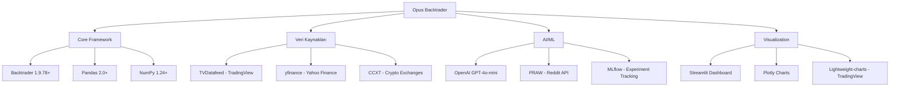
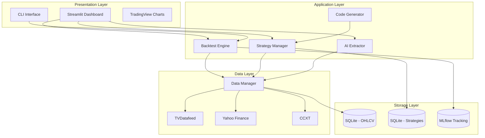
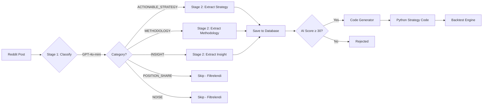
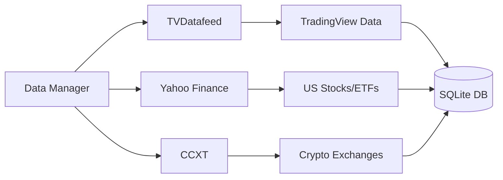
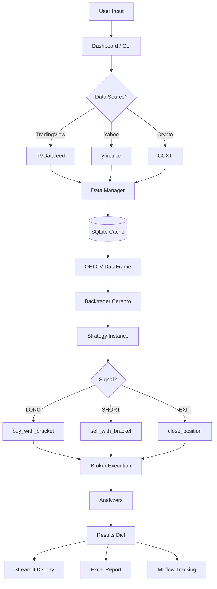
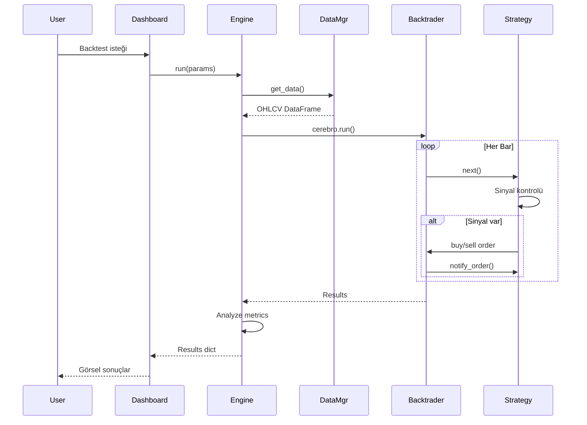
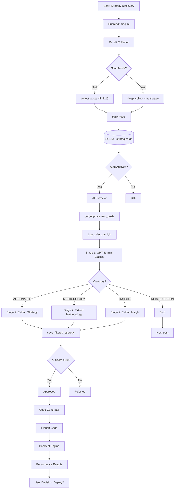
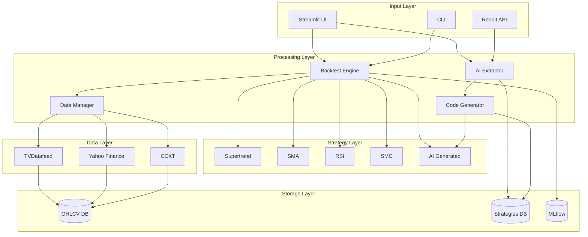

# Opus Backtrader - Detaylı Proje Rehberi

> **Version:** 2.0  
> **Tarih:** 6 Ocak 2026  
> **Proje Tipi:** AI-Destekli Kantitatif Trading Sistemi

---

## 📋 İçindekiler

1. [Proje Genel Bakış](#proje-genel-bakış)
2. [Teknik Altyapı](#teknik-altyapı)
3. [Mimari Tasarım](#mimari-tasarım)
4. [Modül Detayları](#modül-detayları)
5. [Veri Akışı](#veri-akışı)
6. [Stratejiler](#stratejiler)
7. [AI Sistemi](#ai-sistemi)
8. [Kullanım Senaryoları](#kullanım-senaryoları)
9. [Kurulum ve Başlangıç](#kurulum-ve-başlangıç)

---

## 🎯 Proje Genel Bakış

### Amaç ve Vizyon

**Opus Backtrader**, Python tabanlı, enterprise-grade bir **kantitatif trading sistemi**dir. Proje, manuel strateji geliştirmeden **AI destekli otomatik strateji keşfine** uzanan geniş bir yelpazede işlevsellik sunar.

#### Temel Hedefler:

1. **📊 Profesyonel Backtesting**: Backtrader framework üzerine kurulu gelişmiş backtesting motoru
2. **🤖 AI Strateji Keşfi**: Reddit ve sosyal medyadan otomatik strateji toplama ve analiz
3. **🔄 Kod Üretimi**: AI ile keşfedilen stratejilerin otomatik Python koduna dönüştürülmesi
4. **📈 Multi-Market Desteği**: Hisse senedi, kripto, forex, emtia ve endeks desteği
5. **🎨 Görsel Dashboard**: Streamlit tabanlı interaktif kullanıcı arayüzü
6. **📊 TradingView Entegrasyonu**: Lightweight-charts ile profesyonel grafik görselleştirme

---

## 💻 Teknik Altyapı

### Temel Teknolojiler



### Kullanılan Kütüphaneler

#### 🔧 Core Dependencies

| Kütüphane | Versiyon | Kullanım Alanı |
|-----------|----------|----------------|
| `backtrader` | ≥1.9.78 | Backtesting motoru |
| `pandas` | ≥2.0.0 | Veri manipülasyonu |
| `numpy` | ≥1.24.0 | Sayısal hesaplamalar |
| `sqlalchemy` | ≥2.0.0 | Veritabanı yönetimi |

#### 📊 Data Sources

| Kütüphane | Kullanım |
|-----------|----------|
| `yfinance` | US Stocks, ETF veri çekme |
| `ccxt` | Kripto exchange API |
| `tvdatafeed` | TradingView veri akışı (önerilen) |

#### 📈 Visualization

| Kütüphane | Kullanım |
|-----------|----------|
| `streamlit` | Web dashboard |
| `plotly` | İnteraktif grafikler |
| `lightweight-charts` | TradingView benzeri grafikler |

#### 🤖 AI/Research

| Kütüphane | Kullanım |
|-----------|----------|
| `openai` | GPT-4o-mini API (strateji analizi) |
| `praw` | Reddit veri toplama |
| `feedparser` | RSS feed okuma |

#### 📊 Technical Analysis

| Kütüphane | Kullanım |
|-----------|----------|
| `ta` | Temel indikatörler |
| `pandas-ta` | Gelişmiş indikatörler |

---

## 🏛️ Mimari Tasarım

### Proje Klasör Yapısı

```
5.Opus_backtrader/
│
├── 📂 config/                    # Konfigürasyon dosyaları
│   └── secrets.yaml              # API anahtarları (TradingView, OpenAI, Reddit)
│
├── 📂 data/                      # Veri depolama
│   ├── trading.db                # SQLite veritabanı (OHLCV verileri)
│   └── strategies.db             # Strateji veritabanı (AI tarafından keşfedilen)
│
├── 📂 src/                       # Ana kaynak kodu
│   ├── 📁 backtest/              # Backtesting motoru
│   ├── 📁 strategies/            # Trading stratejileri
│   ├── 📁 data/                  # Veri yöneticileri
│   ├── 📁 scraper/               # Reddit scraper ve AI analiz
│   ├── 📁 indicators/            # Özel indikatörler
│   ├── 📁 visualization/         # Grafik ve raporlar
│   ├── 📁 tv_charts/             # TradingView chart entegrasyonu
│   ├── 📁 trading/               # Paper trading
│   ├── 📁 tracking/              # MLflow entegrasyonu
│   ├── 📁 converter/             # Pine Script → Python
│   ├── 📁 agents/                # AI ajanları
│   ├── 📁 tviewdata/             # TviewData Dashboard (harici)
│   └── 📁 utils/                 # Yardımcı fonksiyonlar
│
├── 📂 reports/                   # Backtest raporları (Excel)
├── 📂 mlruns/                    # MLflow experiment verileri
│
├── 📄 dashboard.py               # Ana Streamlit dashboard
├── 📄 main.py                    # CLI entry point
├── 📄 download_data.py           # Veri indirme aracı
├── 📄 requirements.txt           # Python bağımlılıkları
└── 📄 README.md                  # Proje dokümantasyonu
```

### Katmanlı Mimari



---

## 🔧 Modül Detayları

### 1. 📊 Backtest Engine (`src/backtest/`)

**Dosyalar:**
- `engine.py` - Ana backtesting motoru
- `analyzers.py` - Performans analizörleri
- `optimizer.py` - Parametre optimizasyonu

**Yetenekler:**

#### `BacktestEngine` Sınıfı

```python
engine = BacktestEngine()

results = engine.run(
    strategy=SupertrendStrategy,
    symbol='AAPL',
    source='tradingview',
    exchange='NASDAQ',
    interval='1h',
    n_bars=1000,
    initial_cash=100000,
    strategy_params={
        'st_period': 10,
        'st_multiplier': 3.0,
        'risk_pct': 0.02,
        'tp_pct': 3.0,
        'sl_pct': 1.5
    },
    instant_execution=True  # Cheat-on-close mode
)
```

**Metrikler:**
- Sharpe Ratio, Sortino Ratio
- Maximum Drawdown
- Win Rate, Profit Factor
- Average Trade, Total Return
- SQN (System Quality Number)
- Risk:Reward Ratio (hesaplanmış)

#### Özellikler:
- ✅ **Instant Execution**: Aynı bar'da entry/exit (hızlı test)
- ✅ **Bracket Orders**: Otomatik TP/SL
- ✅ **Multiple TP**: 3 kademeli kısmi kar alma
- ✅ **Leverage Support**: 1x-125x kaldıraç
- ✅ **Trade Direction**: Long/Short/Both
- ✅ **Detailed Analytics**: Trade-by-trade analiz

---

### 2. 🎯 Strategies (`src/strategies/`)

**Dosyalar:**
- `base.py` - Temel strateji sınıfı
- `supertrend_strategy.py` - Supertrend stratejisi
- `sma_crossover.py` - SMA crossover
- `rsi_strategy.py` - RSI mean reversion
- `smc_strategy.py` - Smart Money Concepts

#### `BaseStrategy` - Tüm Stratejilerin Atasıdır

**Ortak Özellikler:**

```python
params = (
    ('risk_pct', 0.02),          # Pozisyon başına risk %2
    ('tp_pct', 3.0),             # Take profit %3
    ('sl_pct', 1.5),             # Stop loss %1.5
    ('trade_direction', 'long'), # 'long', 'short', 'both'
    ('use_bracket', True),       # TP/SL aktif
    ('leverage', 1),             # Kaldıraç oranı
)
```

**Fonksiyonlar:**
- `calculate_position_size(stop_price)` - Risk bazlı pozisyon boyutu
- `buy_with_bracket(size, sl_price, tp_price)` - Long giriş + TP/SL
- `sell_with_bracket(size, sl_price, tp_price)` - Short giriş + TP/SL
- `reverse_to_long()` / `reverse_to_short()` - Swing trading

#### Strateji Örnekleri

**1. Supertrend Strategy**

```python
# Entry: Supertrend UP döndüğünde long
# Exit: Supertrend DOWN döndüğünde
# Indicator: Supertrend(period=10, multiplier=3.0)
```

**2. SMA Crossover**

```python
# Entry: Hızlı SMA > Yavaş SMA (golden cross)
# Exit: Hızlı SMA < Yavaş SMA (death cross)
# Indicators: SMA(10), SMA(30)
```

**3. RSI Mean Reversion**

```python
# Entry: RSI < 30 (oversold)
# Exit: RSI > 70 (overbought)
# Indicator: RSI(14)
```

**4. SMC (Smart Money Concepts)**

```python
# Entry: Order block + Fair value gap + breaker
# Exit: Opposite structure break
# Indicators: Swing high/low, ATR
```

---

### 3. 🤖 AI Scraper System (`src/scraper/`)

**En Kritik Modül** - Reddit'ten otomatik strateji keşfi

**Dosyalar:**
- `reddit_collector.py` - Reddit API entegrasyonu
- `ai_extractor.py` - 2 aşamalı AI analizi
- `code_generator.py` - Python kod üretimi
- `strategy_storage.py` - SQLite veritabanı
- `discovery_page.py` - Streamlit UI
- `ai_summarizer.py` - Özet çıkarma

#### 🔄 İki Aşamalı AI Pipeline



#### Stage 1: Sınıflandırma

**Model:** GPT-4o-mini  
**Input:** Reddit post başlık + içerik  
**Output:** 5 kategori

| Kategori | Açıklama | Örnek |
|----------|----------|-------|
| `ACTIONABLE_STRATEGY` | Kodlanabilir strateji | "RSI<30'da al, RSI>70'te sat" |
| `METHODOLOGY` | Genel yaklaşım | "SMC ile trading nasıl yapılır" |
| `INSIGHT` | Piyasa analizi | "Fed faiz kararı etkileri" |
| `POSITION_SHARE` | Sadece pozisyon paylaşımı | "AAPL long açtım" |
| `NOISE` | İlgisiz | "Yeni başlıyorum tavsiye?" |

**Maliyet:** ~$0.00003/post

#### Stage 2: Strateji Çıkarma

**Model:** GPT-4o-mini  
**Input:** ACTIONABLE_STRATEGY olarak işaretlenmiş post  
**Output:** JSON formatında strateji detayları

```json
{
  "strategy_name": "RSI Mean Reversion",
  "summary": "RSI göstergesine dayalı aşırı alım/satım stratejisi",
  "entry_rules": "RSI(14) < 30 ve kapanış > EMA(20)",
  "exit_rules": "RSI(14) > 70 veya %3 kar al",
  "indicators": [
    {"name": "rsi", "params": {"period": 14}},
    {"name": "ema", "params": {"period": 20}}
  ],
  "timeframe": "1h",
  "markets": ["stocks", "crypto"],
  "tp_pct": 3.0,
  "sl_pct": 1.5,
  "ai_score": 75,
  "ai_notes": "Basit ve test edilebilir strateji"
}
```

**Puanlama Sistemi (AI Score):**

- **Base Score:** 50
- **Bonuslar:**
  - ✅ Entry/exit tanımlı: +15
  - ✅ TP/SL belirtilmiş: +10
  - ✅ Backtest sonucu var: +15
  - ✅ Tekrarlanabilir: +10
- **Toplam:** 0-100 arası

**Threshold:**
- ≥30: Kabul edilebilir
- ≥50: İyi
- ≥70: Mükemmel

**Maliyet:** ~$0.0002/post

#### Code Generator

**Dosya:** `code_generator.py`

AI'dan çıkarılan stratejiyi Backtrader uyumlu Python koduna çevirir.

**Örnek Output:**

```python
import backtrader as bt
from src.strategies.base import BaseStrategy

class RSIMeanReversion(BaseStrategy):
    """
    RSI Mean Reversion Strategy
    
    AI Generated from Reddit
    """
    
    params = (
        ('rsi_period', 14),
        ('oversold', 30),
        ('overbought', 70),
        ('risk_pct', 0.02),
        ('tp_pct', 3.0),
        ('sl_pct', 1.5),
    )
    
    def __init__(self):
        super().__init__()
        self.rsi = bt.indicators.RSI(period=self.params.rsi_period)
    
    def next(self):
        if not self.position:
            if self.rsi < self.params.oversold:
                self.buy_with_bracket()
        else:
            if self.rsi > self.params.overbought:
                self.close_position()
```

**Validation:**
- ✅ Syntax check (compile)
- ✅ Import check
- ✅ Indicator parametreleri

---

### 4. 📊 Data Manager (`src/data/`)

**Dosyalar:**
- `manager.py` - Veri yönetimi
- `database.py` - SQLite işlemleri

**Desteklenen Kaynaklar:**



**Kullanım:**

```python
from src.data import DataManager

manager = DataManager()

# TradingView'dan veri çek
df = manager.get_data(
    symbol='BTCUSDT',
    source='tradingview',
    interval='1h',
    exchange='BINANCE',
    n_bars=1000
)
```

**Timeframes:**
- `1m`, `5m`, `15m`, `30m`, `1h`, `4h`, `1d`, `1w`

**Exchanges:**
- `NASDAQ`, `NYSE`, `BINANCE`, `FX_IDC`, `BIST`, `TVC`

---

### 5. 📈 Visualization (`src/visualization/`)

**Dosyalar:**
- `charts.py` - Plotly grafikleri
- `reports.py` - Excel raporları

**TradingView Charts (`src/tv_charts/`):**
- `trading_chart.py` - Lightweight-charts entegrasyonu
- `indicators.py` - Grafik indikatörleri
- `chart_viewer.py` - Pencere yönetimi

**Özellikler:**
- 📊 Candlestick grafikler
- 📌 Trade işaretçileri (entry/exit)
- 📈 Equity curve overlay
- 🎨 Indikatör görselleştirme (Supertrend, RSI, SMA)
- 💰 Metrik paneli

---

### 6. 🎨 Dashboard (`dashboard.py`)

**Streamlit Tabanlı Web UI**

**Sayfalar:**

1. **🏠 Dashboard** - Ana sayfa, hızlı backtest
2. **🔬 Backtest** - Detaylı backtest konfigürasyonu
3. **🔍 Strategy Discovery** - Reddit scraper
4. **🎯 Optimize** - Parametre optimizasyonu
5. **📥 Data Manager** - Veri indirme
6. **💹 Paper Trade** - Simülasyon (geliştirilmekte)
7. **🔄 Pine Convert** - Pine Script → Python (geliştirilmekte)
8. **📊 Compare** - Strateji karşılaştırma
9. **📋 History** - Geçmiş backtestler
10. **⚙️ Settings** - Ayarlar

**Başlatma:**

```bash
streamlit run dashboard.py
```

---

## 📊 Veri Akışı

### Backtest Akışı

````carousel


<!-- slide -->


````

### AI Strateji Keşfi Akışı



---

## 🎯 Kullanım Senaryoları

### Senaryo 1: Manuel Strateji Backtesti

**Adımlar:**

1. **Dashboard Başlat:**
   ```bash
   streamlit run dashboard.py
   ```

2. **Backtest Sayfası:**
   - Sembol: `BTCUSDT`
   - Exchange: `BINANCE`
   - Timeframe: `4h`
   - Strateji: `Supertrend`
   - Parametreler: Period=10, Multiplier=3.0
   - Bracket Orders: Aktif (TP=3%, SL=1.5%)

3. **Sonuçları İncele:**
   - Sharpe Ratio: 1.85
   - Win Rate: 62%
   - Max Drawdown: -12%
   - Total Return: +45%

4. **TradingView Grafiği Aç:**
   - Trade işaretçileri
   - Supertrend overlay
   - Equity curve

---

### Senaryo 2: AI ile Strateji Keşfi

**Adımlar:**

1. **Strategy Discovery Sayfası:**
   - Subredditler: `algotrading`, `Daytrading`
   - Scan Mode: Derin (3 sayfa)
   - Min Upvote: 5

2. **Toplama ve Analiz:**
   - 150 post toplandı
   - AI analizi başlatıldı
   - Stage 1: 150 post sınıflandırıldı
     - 12 ACTIONABLE_STRATEGY
     - 8 METHODOLOGY
     - 25 INSIGHT
     - 105 NOISE/POSITION_SHARE

3. **Filtreleme:**
   - 12 strateji Stage 2'ye gönderildi
   - 8 stratejinin AI Score ≥ 30

4. **Kod Üretimi:**
   - "RSI Divergence Strategy" seçildi
   - Python kodu üretildi
   - Validation: ✅ Geçti

5. **Backtest:**
   - Üretilen kod backtest edildi
   - Total Return: +28%
   - Sharpe Ratio: 1.45
   - Karar: Approved ✅

**Maliyet Analizi:**
- Stage 1: 150 post × $0.00003 = $0.0045
- Stage 2: 12 post × $0.0002 = $0.0024
- **Toplam: $0.0069** (1 cent altında!)

---

### Senaryo 3: CLI Kullanımı

```bash
# Supertrend backtest
python main.py --strategy supertrend --symbol AAPL --timeframe 1d --bars 1000

# SMC stratejisi crypto'da
python main.py --strategy smc --symbol BTCUSDT --source tradingview --exchange BINANCE --timeframe 4h

# Parametre optimizasyonu
python main.py --optimize --symbol AAPL --strategy supertrend

# Grafik ile sonuç
python main.py --strategy sma --symbol TSLA --chart
```

---

## 🚀 Kurulum ve Başlangıç

### Ön Gereksinimler

- Python 3.9+
- Windows / macOS / Linux

### Kurulum Adımları

````carousel
```bash
# 1. Repository'yi klonlayın
cd c:\Users\akmes\1.Backtest_works\5.Opus_backtrader

# 2. Virtual environment oluşturun
python -m venv venv

# Windows'ta aktifleştir
venv\Scripts\activate

# macOS/Linux'ta
source venv/bin/activate
```

<!-- slide -->

```bash
# 3. Bağımlılıkları yükleyin
pip install -r requirements.txt

# 4. TVDatafeed'i manuel yükleyin (GitHub'dan)
pip install https://github.com/rongardF/tvdatafeed/archive/main.zip
```

<!-- slide -->

```yaml
# 5. config/secrets.yaml dosyasını oluşturun
tradingview:
  username: "your_email@example.com"
  password: "your_password"

openai:
  api_key: "sk-..."

reddit:
  client_id: "..."
  client_secret: "..."
  user_agent: "..."
```

<!-- slide -->

```bash
# 6. Dashboard'u başlatın
streamlit run dashboard.py

# Veya CLI ile test edin
python main.py --strategy supertrend --symbol AAPL --timeframe 1d
```
````

---

## 🎓 Yetenekler ve Özellikler

### ✅ Mevcut Özellikler

#### Backtesting
- [x] Multi-timeframe support (1m - 1w)
- [x] Multi-market (stocks, crypto, forex, commodities)
- [x] Instant execution (cheat-on-close)
- [x] Bracket orders (TP/SL)
- [x] Multiple TP levels (3-tier)
- [x] Leverage support (1x-125x)
- [x] Trade direction control (long/short/both)
- [x] Risk-based position sizing
- [x] Detailed performance metrics

#### Stratejiler
- [x] Supertrend
- [x] SMA Crossover
- [x] RSI Mean Reversion
- [x] SMC (Smart Money Concepts)
- [x] BaseStrategy framework

#### AI Sistemi
- [x] Reddit scraper (PRAW)
- [x] 2-stage AI classification
- [x] Strategy extraction (GPT-4o-mini)
- [x] Code generation
- [x] Code validation
- [x] Cost tracking

#### Visualization
- [x] Streamlit dashboard
- [x] Plotly charts
- [x] TradingView lightweight-charts
- [x] Excel reports
- [x] MLflow tracking

#### Data
- [x] TVDatafeed integration
- [x] Yahoo Finance
- [x] CCXT (crypto)
- [x] SQLite caching
- [x] Multi-exchange support

---

## 📈 Akış Diyagramları

### Sistem Genel Bakış



---

## 💡 En İyi Pratikler

### Backtest Tavsiyeleri

> [!TIP]
> **Instant Execution modunu doğru kullanın**
> - Hızlı test için: Aktif
> - Gerçekçi sonuçlar için: Pasif

> [!IMPORTANT]
> **Minimum test süresi**: Her timeframe için yeterli bar kullanın
> - 1h timeframe: Min 1000 bar (≈42 gün)
> - 1d timeframe: Min 500 bar (≈2 yıl)

> [!WARNING]
> **Overfitting riskine dikkat**
> - Parametre optimizasyonunda çok fazla değişken optimize etmeyin
> - Out-of-sample test yapın

### AI Strateji Keşfi

> [!NOTE]
> **Threshold değerleri**
> - 30-50: Manuel inceleme gerekli
> - 50-70: İyi kalite
> - 70+: Yüksek potansiyel

> [!CAUTION]
> **Token maliyeti kontrolü**
> - Büyük toplama yapmadan önce maliyet hesaplayın
> - 1000 post ≈ $0.05 (Stage 1 + Stage 2)

---

## 🔮 Geliştirilmekte Olan Özellikler

### Yakında Gelecek

- [ ] **Paper Trading Module**: Gerçek zamanlı simülasyon
- [ ] **Pine Script Converter**: TradingView stratejilerini Python'a çevirme
- [ ] **Multi-strategy Portfolio**: Portföy düzeyinde backtest
- [ ] **Walk-forward Analysis**: Otomatik rolling test
- [ ] **Twitter/X Scraper**: Reddit'e ek sosyal medya kaynağı
- [ ] **Telegram Bot**: Sinyal bildirimleri
- [ ] **Cloud Deployment**: AWS/GCP entegrasyonu

---

## 📞 Destek ve Katkı

### İletişim

Bu proje **Akmes** tarafından geliştirilmektedir.

### Katkıda Bulunma

Proje aktif geliştirme aşamasındadır. Yeni özellik önerileri ve hata raporları için issue açabilirsiniz.

---

## 📄 Lisans

Bu proje kişisel kullanım içindir.

---

## 🙏 Teşekkürler

- **Backtrader** - Backtesting framework
- **OpenAI** - GPT-4o-mini API
- **TradingView** - TVDatafeed
- **Streamlit** - Dashboard framework

---

**Son Güncelleme:** 6 Ocak 2026  
**Doküman Versiyonu:** 2.0
